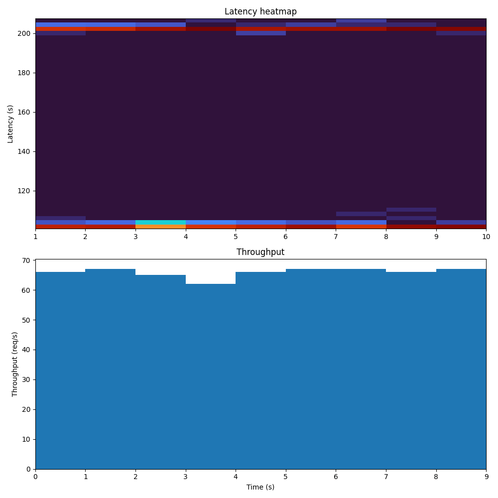

# Latency heatmap visualization

The goal of this repo is to eventually become a testbed for different types of concurrency models and their effect on system saturation.

Right now, all it does is generate a single image out of a load test.

When we run the following command:
```
docker-compose build && docker-compose run load-test && docker-compose run visualize && docker-compose down
```

Then the following image gets generated:

